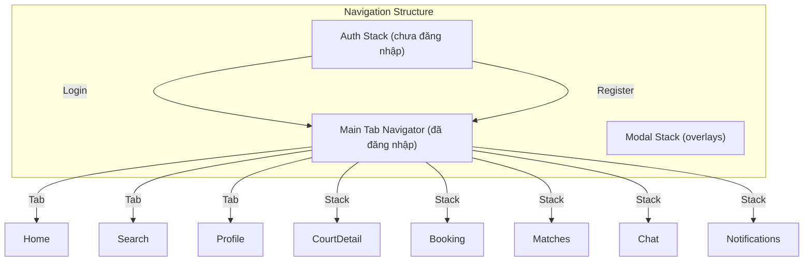

# Kế Hoạch Thiết Kế Giao Diện Mobile - SportHub

## Tổng Quan Kiến Trúc



---

## Phase 1: Authentication Flow

### 1.1 Auth Screens (`app/(auth)/`)

| Screen | File | Mô tả |
|--------|------|--------|
| Splash | `splash.tsx` | Logo + loading animation |
| Login | `login.tsx` | Email/password form, social login buttons, forgot password link |
| Register | `register.tsx` | Full registration form (name, email, phone, password) |
| Forgot Password | `forgot-password.tsx` | Email input, send reset link |
| Reset Password | `reset-password.tsx` | New password form with token |

### 1.2 Cần tạo thêm components:
- `src/components/ui/TextInput.tsx` - Input với validation, error state
- `src/components/ui/SocialButtons.tsx` - Google, Facebook, Apple buttons
- `src/components/ui/Checkbox.tsx` - Terms agreement checkbox

---

## Phase 2: Tab Navigation & Home

### 2.1 Cập nhật Main Tab Navigator (`app/(tabs)/_layout.tsx`)

Thêm icon cho mỗi tab:
- **Trang chủ** - `home-outline` / `home`
- **Tìm kiếm** - `search-outline` / `search`
- **Hồ sơ** - `person-outline` / `person`

### 2.2 Cập nhật Home Screen (`app/(tabs)/index.tsx`)

```typescript
// Cấu trúc màn hình Home:
- Header với logo + notification bell icon
- Search bar (navigate to search)
- Sports grid (horizontal scroll)
- Featured courts section (Carousel)
- Nearby courts section
- Open matches section (cho phép join)
- Quick actions floating buttons
```

---

## Phase 3: Search & Filter

### 3.1 Cập nhật Search Screen (`app/(tabs)/search.tsx`)

```typescript
// Tính năng cần thêm:
- Filter chips (sport, price range, rating, distance)
- Sort options (distance, rating, price)
- View toggle (list/grid)
- Recent searches
- Search suggestions
```

### 3.2 Cần tạo components:
- `src/components/ui/FilterChip.tsx` - Selectable filter chip
- `src/components/ui/SearchBar.tsx` - Search input với icon
- `src/components/CourtCard.tsx` - Court card với full info
- `src/components/SportChip.tsx` - Sport icon chip
- `src/components/PriceRangeSlider.tsx` - Range slider cho giá

---

## Phase 4: Court Detail & Booking

### 4.1 Tạo Court Detail Screen (`app/court/[id].tsx`)

```typescript
// Cấu trúc màn hình:
- Image gallery (horizontal scroll)
- Court name + rating + review count
- Address với map preview
- Amenities icons
- Description
- Reviews section (preview)
- Time slot picker
- Book Now floating button
```

### 4.2 Tạo Booking Flow Screens

| Screen | File | Mô tả |
|--------|------|--------|
| Select Date/Time | `booking/[courtId].tsx` | Calendar + time slots |
| Booking Confirm | `booking/confirm.tsx` | Summary + payment method |
| Booking Success | `booking/success.tsx` | Success + QR code |
| My Bookings | `bookings/index.tsx` | List với tabs (upcoming/past/cancelled) |
| Booking Detail | `booking/[id].tsx` | Detail + QR code + actions |

### 4.3 Cần tạo components:
- `src/components/ui/ImageCarousel.tsx` - Gallery component
- `src/components/ui/Calendar.tsx` - Date picker calendar
- `src/components/TimeSlotPicker.tsx` - Time slot grid
- `src/components/BookingCard.tsx` - Booking list item
- `src/components/QRCode.tsx` - QR code display
- `src/components/AmenityIcon.tsx` - Amenity icons display
- `src/components/ReviewCard.tsx` - Review item
- `src/components/StarRating.tsx` - Rating display/input

---

## Phase 5: Match System

### 5.1 Match Screens

| Screen | File | Mô tả |
|--------|------|--------|
| Match List | `matches/index.tsx` | Tabs: Discover / My Matches |
| Match Detail | `matches/[id].tsx` | Full match info + players + actions |
| Create Match | `matches/create.tsx` | Form tạo match mới |
| Match Chat | `matches/[id]/chat.tsx` | Real-time chat |
| Match Search | `matches/search.tsx` | Filter & search matches |

### 5.2 Cần tạo components:
- `src/components/MatchCard.tsx` - Match card với info
- `src/components/PlayerList.tsx` - Player avatars + status
- `src/components/MatchStatusBadge.tsx` - Status chip
- `src/components/ChatBubble.tsx` - Chat message bubble
- `src/components/ChatInput.tsx` - Message input
- `src/components/DateTimePicker.tsx` - Date + time picker

---

## Phase 6: Profile & Settings

### 6.1 Profile Screens

| Screen | File | Mô tả |
|--------|------|--------|
| Edit Profile | `profile/edit.tsx` | Update name, bio, phone, DOB |
| Change Password | `profile/change-password.tsx` | Password change form |
| My Reviews | `profile/reviews.tsx` | User's reviews |
| My Stats | `profile/stats.tsx` | Detailed statistics |
| Settings | `settings/index.tsx` | App settings |

### 6.2 Cần tạo components:
- `src/components/ProfileAvatar.tsx` - Avatar với edit button
- `src/components/StatCard.tsx` - Statistics card
- `src/components/SettingsItem.tsx` - Settings list item

---

## Phase 7: Chat System

### 7.1 Chat Screens

| Screen | File | Mô tả |
|--------|------|--------|
| Conversation List | `chat/index.tsx` | List conversations |
| Chat Room | `chat/[id].tsx` | Real-time messages |
| New Chat | `chat/new.tsx` | Start new conversation |

### 7.2 Cần tạo components:
- `src/components/ConversationItem.tsx` - Conversation list item
- `src/components/MessageBubble.tsx` - Message display
- `src/components/ChatInput.tsx` - Message input với send button

---

## Phase 8: Notifications

### 8.1 Notification Screens

| Screen | File | Mô tả |
|--------|------|--------|
| Notification List | `notifications/index.tsx` | List all notifications |
| Notification Settings | `notifications/settings.tsx` | Toggle notification channels |

### 8.2 Cần tạo components:
- `src/components/NotificationItem.tsx` - Notification list item

---

## Phase 9: Core Infrastructure

### 9.1 State Management (`src/store/`)

```
src/store/
├── authStore.ts        - User auth state
├── cartStore.ts        - Booking cart state
├── notificationStore.ts - Unread count
└── settingsStore.ts    - App settings
```

### 9.2 API Layer (`src/api/`)

```
src/api/
├── client.ts           - Axios instance setup
├── auth.ts            - Auth endpoints
├── courts.ts          - Courts endpoints
├── bookings.ts        - Bookings endpoints
├── matches.ts         - Matches endpoints
├── chat.ts            - Chat endpoints
├── users.ts           - User endpoints
└── notifications.ts   - Notification endpoints
```

### 9.3 Hooks (`src/hooks/`)

```
src/hooks/
├── useAuth.ts         - Auth hook
├── useCourts.ts      - Courts queries
├── useBookings.ts     - Bookings queries
├── useMatches.ts      - Matches queries
├── useChat.ts         - Chat queries
└── useNotifications.ts - Notification queries
```

### 9.4 Types (`src/types/`)

```
src/types/
├── auth.ts            - Auth types
├── court.ts          - Court types
├── booking.ts        - Booking types
├── match.ts          - Match types
├── chat.ts           - Chat types
└── user.ts           - User types
```

---

## Hướng Dẫn Từng Bước Thực Hiện

### Bước 1: Setup Infrastructure
1. Tạo API client với axios
2. Setup React Query provider
3. Tạo auth store với Zustand
4. Tạo type definitions

### Bước 2: Auth Flow
1. Tạo TextInput component
2. Tạo Auth screens (Login, Register)
3. Setup navigation guards
4. Test login/register flow

### Bước 3: Home & Search
1. Cập nhật Home screen
2. Tạo CourtCard component
3. Cập nhật Search screen với filters
4. Tạo Court Detail screen

### Bước 4: Booking System
1. Tạo Calendar component
2. Tạo TimeSlotPicker
3. Tạo Booking flow screens
4. Tạo My Bookings screen

### Bước 5: Match System
1. Tạo MatchCard component
2. Tạo Match List screen
3. Tạo Match Detail screen
4. Tạo Create Match screen

### Bước 6: Chat & Notifications
1. Tạo Chat components
2. Tạo Chat screens
3. Tạo Notification screens

### Bước 7: Profile & Settings
1. Cập nhật Profile screen
2. Tạo Edit Profile screen
3. Tạo Settings screens

---

## File Structure Cuối Cùng

```
apps/mobile/
├── app/
│   ├── _layout.tsx              # Root layout
│   ├── index.tsx                # Redirect to tabs
│   ├── (tabs)/
│   │   ├── _layout.tsx          # Tab navigator
│   │   ├── index.tsx           # Home
│   │   ├── search.tsx          # Search
│   │   └── profile.tsx         # Profile
│   ├── (auth)/
│   │   ├── login.tsx
│   │   ├── register.tsx
│   │   └── forgot-password.tsx
│   ├── court/
│   │   └── [id].tsx            # Court detail
│   ├── booking/
│   │   ├── [courtId].tsx       # Select time
│   │   ├── confirm.tsx         # Confirm booking
│   │   └── success.tsx         # Success
│   ├── bookings/
│   │   ├── index.tsx           # My bookings
│   │   └── [id].tsx            # Booking detail
│   ├── matches/
│   │   ├── index.tsx           # Match list
│   │   ├── [id].tsx            # Match detail
│   │   ├── create.tsx          # Create match
│   │   └── search.tsx          # Search matches
│   ├── chat/
│   │   ├── index.tsx           # Conversations
│   │   ├── [id].tsx            # Chat room
│   │   └── new.tsx             # New chat
│   ├── notifications/
│   │   └── index.tsx           # Notifications
│   └── settings/
│       └── index.tsx           # Settings
├── src/
│   ├── api/
│   │   ├── client.ts
│   │   ├── auth.ts
│   │   ├── courts.ts
│   │   ├── bookings.ts
│   │   ├── matches.ts
│   │   ├── chat.ts
│   │   └── users.ts
│   ├── components/
│   │   ├── ui/
│   │   │   ├── Button.tsx
│   │   │   ├── Card.tsx
│   │   │   ├── Avatar.tsx
│   │   │   ├── TextInput.tsx
│   │   │   ├── FilterChip.tsx
│   │   │   ├── Calendar.tsx
│   │   │   └── index.ts
│   │   ├── CourtCard.tsx
│   │   ├── MatchCard.tsx
│   │   ├── BookingCard.tsx
│   │   ├── ReviewCard.tsx
│   │   ├── ChatBubble.tsx
│   │   └── index.ts
│   ├── constants/
│   │   └── colors.ts
│   ├── hooks/
│   │   ├── useAuth.ts
│   │   ├── useCourts.ts
│   │   └── ...
│   ├── store/
│   │   ├── authStore.ts
│   │   └── ...
│   ├── types/
│   │   ├── auth.ts
│   │   ├── court.ts
│   │   └── ...
│   └── utils/
│       └── ...
└── ...
```